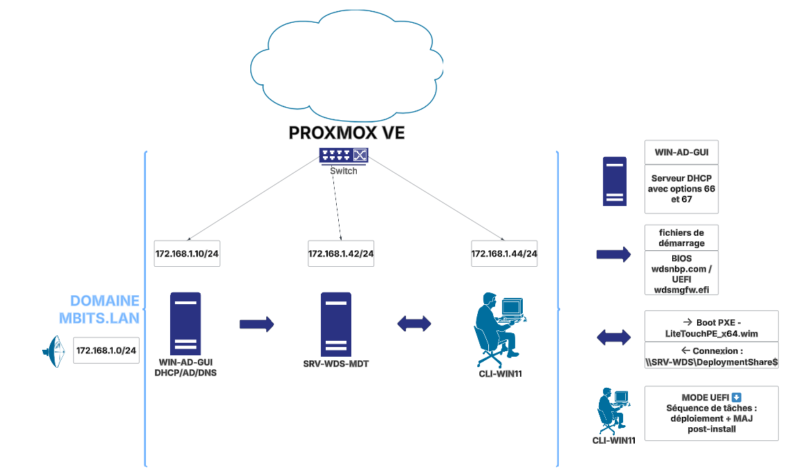

# Déploiement automatisé de Windows 11 24H2 avec MDT – Proxmox VE

Infrastructure de déploiement automatisé de postes de travail Windows 11 sur un cloud privé Proxmox,
avec ajout de Microsoft Deployment Toolkit (MDT) à un serveur WDS existant pour gérer le déploiement et les mises à jour post-installation.

🔗 Ce dépôt constitue la **suite directe** du projet [wds-pxe-proxmox](https://github.com/MB7M/wds-pxe-proxmox) dédié à la configuration du PXE avec WDS.

## Schéma d’architecture

  


## Architecture

- Hyperviseur : Proxmox VE
- Réseau : 172.168.1.0/24 (bridge)
- Domaine : MBITS.LAN

### Machines virtuelles :

- `WIN-AD-GUI` : Windows Server 2022 – AD / DNS / DHCP
- `SRV-WDS-MDT` : Windows Server 2022 – Serveur WDS + MDT
- `CLI-WIN11` : Client Windows 11 – Boot PXE / UEFI / Séquence MDT

## Services déployés

- DHCP avec options PXE (066 / 067)
- WDS (Windows Deployment Services)
- MDT (Microsoft Deployment Toolkit)

## Documentation technique

Accessible dans [`/docs`](./docs) :

- [`01_installation_adk.md`](./docs/01_installation_adk.md) – Installation de Windows ADK 10.1.26100.2454
- [`02_installation_mdt.md`](./docs/02_installation_mdt.md) – Installation et configuration initiale de MDT
- [`03_mdt_config_win11_24H2.md`](./docs/03_mdt_config_win11_24H2.md) – Ajustements pour la compatibilité avec Windows 11 24H2
- [`04_mdt_import_os_taskseq.md`](./docs/04_mdt_import_os_taskseq.md) – Import de l’image Windows 11 et création de séquence
- [`05_mdt_config_bootstrap_customsettings.md`](./docs/05_mdt_config_bootstrap_customsettings.md) – Configuration de `bootstrap.ini` et `CustomSettings.ini`
- [`06_generation_litetouch_import_wds.md`](./docs/06_generation_litetouch_import_wds.md) – Génération de l’image LiteTouch et import dans WDS
- [`07_deploiement_win11_24H2_mdt.md`](./docs/07_deploiement_win11_24H2_mdt.md) – Déploiement automatisé d’un poste Windows 11

## Automatisation

Le script PowerShell [`scripts/create_mdt_service_account.ps1`](scripts/mdt_service_account.ps1) automatise :

- La création du compte local `Service_MDT`
- L’attribution des droits NTFS sur `DeploymentShare$`
- L’accès sécurisé au partage par les clients en PXE

## Structure du dépôt

```
mdt-pxe-proxmox/
├── captures/
│   └── schema-pxe-wds-mdt.png
│
├── docs/
│   ├── 01_installation_adk.md
│   ├── 02_installation_mdt.md
│   ├── 03_mdt_config_win11_24H2.md
│   ├── 04_mdt_import_os_taskseq.md
│   ├── 05_mdt_config_bootstrap_customsettings.md
│   ├── 06_generation_litetouch_import_wds.md
│   └── 07_deploiement_win11_24H2_mdt.md
│
├── scripts/
│   └── mdt_service_account.ps1
│
├── .gitignore
└── README.md
```

## Objectifs atteints

- Déploiement PXE complet avec MDT intégré à WDS
- Installation automatique de Windows 11 24H2
- Mises à jour post-installation incluses dans la séquence MDT
- Réseau virtualisé sous Proxmox VE
