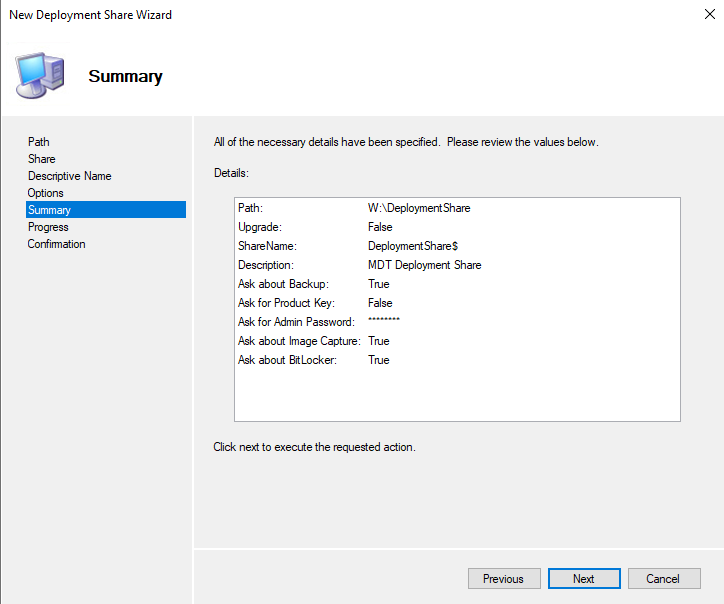
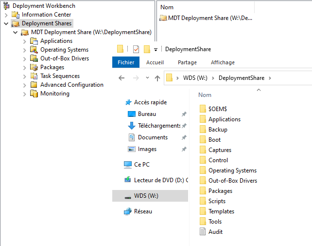
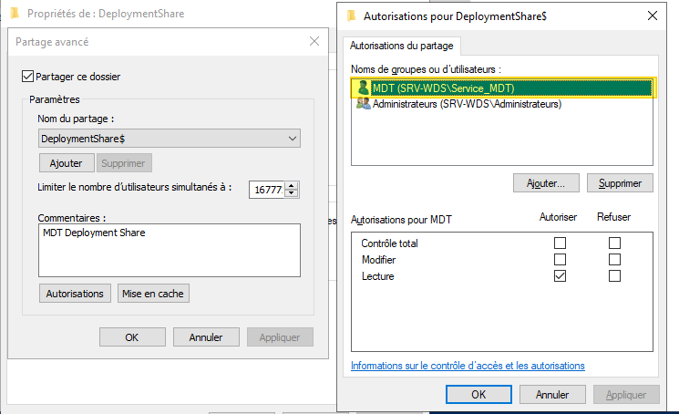

# Installer Microsoft Deployment Toolkit (MDT) sur Windows Server 2022

## Objectif

Installer **Microsoft Deployment Toolkit (MDT)** et configurer le **Deployment Share** dans le cadre du déploiement automatisé de **Windows 11 version 24H2**.  
Le Deployment Share servira à centraliser les images, pilotes, séquences de tâches et scripts nécessaires à l’installation des postes de travail via MDT.

> Pour l’installation de l’ADK et WinPE, se référer à [`installation_adk.md`](installation_adk.md).  
> Pour la configuration de WDS, se référer à [`installation_wds.md`](installation_wds.md).

---

## Prérequis

- **Windows Server 2022** à jour  
- **ADK 10.1.26100.2454** et **WinPE Add-on** installés (`installation_adk.md`)  
- Compte administrateur local  
- **Partition ou disque dédié** pour le Deployment Share (exemple : `D:\` ou `W:\`) — éviter le disque système `C:` pour séparer les données de déploiement de l’OS serveur  
- Serveur WDS prêt 

---

## Installer MDT sur Windows Server 2022

### A. Installer le composant MDT

#### Téléchargement :

- **MDT (Microsoft Deployment Toolkit) - Dernière version 64 bits :**  
  [Télécharger MDT ](https://download.microsoft.com/download/3/3/9/339be62d-b4b8-4956-b58d-73c4685fc492/MicrosoftDeploymentToolkit_x64.msi)

#### Étapes :

1. Exécuter le fichier `MicrosoftDeploymentToolkit_x64.msi`.
2. Cliquer sur **Next** à chaque étape de l’assistant.
3. Conserver les chemins par défaut pour l’installation de MDT.
4. Ne rien modifier dans la sélection des fonctionnalités (choix par défaut).
 
  

Dans le menu Démarrer, on retrouve la console "Deployement" Workbench qui permet d'utiliser MDT.


---

### B. Créer le Deployment Share

#### Étapes :

1. Ouvrir la console **Deployment Workbench** (menu Démarrer → Microsoft Deployment Toolkit → Deployment Workbench).
2. Clic droit sur **Deployment Shares** → **New Deployment Share**.
3. Configurer comme suit :

| Option                       | Valeur conseillée                                                                                      |
| ---------------------------- | ------------------------------------------------------------------------------------------------------ |
| Deployment Share path        | `D:\DeploymentShare` (ou partition dédiée)  
| Deployment Share name        | Conserver la valeur par défaut `DeploymentShare$`                                                      |
| Deployment Share description | Mettre un nom descriptif : `MDT Deployment Share`                                                        |

4. Conserver les options par défaut lors de l’assistant.  

  

5. Valider jusqu’à la fin.
   
On retrouve le contenu du Deployment Share dans la console MDT, mais aussi à partir de l'Explorateur de fichiers Windows.  



---

### C. Créer un utilisateur local dédié à MDT 

Lorsque les machines clientes démarrent en **boot PXE** pour installer le système d’exploitation via MDT, elles doivent se connecter au Deployment Share pour accéder aux ressources suivantes :
- Images de déploiement,
- Pilotes,
- Séquences de tâches,
- Applications, etc.

Cette connexion nécessite un compte utilisateur disposant des droits suffisants sur le partage. Pour sécuriser l’environnement, il est recommandé de créer un **compte local dédié**, sans privilèges administrateur, et de lui attribuer uniquement les droits nécessaires (**lecture et exécution uniquement**).

#### Script PowerShell pour la création  :

```powershell
# Spécifier le nom et le mot de passe du compte de service
$ServiceAccountName = "Service_MDT"
$ServiceAccountPassword = ConvertTo-SecureString "héhé" -AsPlainText -Force

# Créer le compte local sans privilèges administrateur
New-LocalUser $ServiceAccountName -Password $ServiceAccountPassword -FullName "MDT" -Description "Compte de service pour MDT"

# Ajouter les droits en lecture sur le partage MDT
Grant-SmbShareAccess -Name "DeploymentShare$" -AccountName "Service_MDT" -AccessRight Read -Force

# Attribuer les permissions NTFS nécessaires (Lecture et Exécution)
$MDTSharePath = "\\$env:COMPUTERNAME\DeploymentShare$"
$Acl = Get-Acl $MDTSharePath
$Rule = New-Object System.Security.AccessControl.FileSystemAccessRule("Service_MDT","ReadAndExecute", "ContainerInherit, ObjectInherit", "None", "Allow")
$Acl.SetAccessRule($Rule)
Set-Acl $MDTSharePath $Acl
```


### D. Vérification des droits  

Suite à l'exécution de ce script, l'utilisateur "**Service_MDT**" a bien un accès en lecture seule sur le Deployment Share.  



Il faut que les droits soient corrects (droits de partage et droits NTFS), sinon l'assistant de déploiement ne fonctionnera pas correctement.
